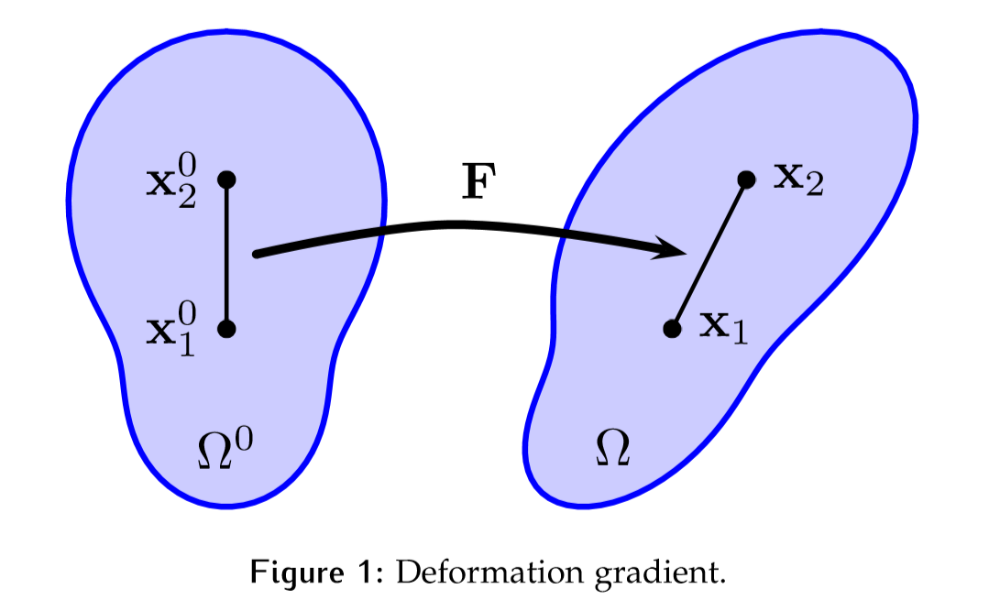

# 用于模拟连续物体的物质点法   
> 作者：Chenfanfu Jiang, Craig Schroeder, Joseph Teran, Alexey Stomakhin, and Andrew Selle    
译者：Elxe
---
## 绪论
对于物体以及液体变形的物理行为的模拟一直是计算机图形学中非常重要的部分。拉格朗日有限元法（Finite Element Method，FEM）一直被广泛用于弹塑性固体，但是处理大变形，网格变形，断裂，自碰撞和材料之间的耦合的情况下，通常需要附加的计算组件。通常需要针对特定​​问题开发特殊的求解器和策略。最近，混合欧拉（Eulerian）/拉格朗日（Lagrangian）材料点方法（Material Point Method，MPM）被引入计算机图形社区。它使用了控制方程的连续描述，并利用了用户可控制的弹塑性本构模型。 MPM的混合性质允许使用常规的笛卡尔网格自动处理自碰撞和断裂。与其他粒子方法（例如，平滑粒子流体动力学（SPH））一样，由于拉格朗日粒子之间缺乏明确的连通性，拓扑更改也很容易。此外，MPM允许基于网格的隐式积分方案，其条件独立于拉格朗日粒子的数量。 MPM还提供了统一的粒子模拟框架，类似于基于位置的动力学（PBD），可轻松耦合不同的材料。 MPM的功能已在许多最近的论文中得到了证明，它们可以模拟各种材料，包括弹性物体，雪，熔岩，沙子和粘弹性流体。它还高度集成到迪斯尼动画工作室的制作框架中，并已用于特色动画，包括《冰雪奇缘》，《超能陆战队6》和《疯狂动物城》。

## 介绍
模拟虚拟世界和角色的自然现象是非常重要的应用，但是仍旧非常具有挑战性。相关从业人员对操纵和理解物理模拟的需求强加了很大的约束，但几乎所有的模拟方法都需要涉及拉格朗日粒子。此外，对计算效率，拓扑变化和数值稳定性的需求使工程师们转向了拉格朗日/欧拉混合方法。在本课程中，我们将重点放在材料点方法（MPM）上，该方法随着“单元内粒子”（PIC）和“流体隐式粒子方法”（FLIP）对固体力学的推广而发展[Sulsky等，1995]。 MPM方法将拉格朗日材料粒子与欧拉笛卡尔网格相结合。值得注意的是，拉格朗日网格连接并没有内在的需要（与传统拉格朗日法本质上的区别，网格之间没有内在联系）。
许多图形研究人员已经尝试了混合网格和粒子方法。尽管FLIP早已在图形界作为一种有用的液体模拟方法而广为人知[ZhuandBridson，2005; Bridson，2008; AndoandTsuruno，2011]，但MPM最近才引入。
MPM已被证明是一种非常有效的混合粒子/网格方法，用于模拟计算机图形学中的各种固体材料。Stomakhin等[2013]和迪士尼的《冰雪奇缘》使用MPM模拟雪。Hegemann等[2013]使用源自MPM的脉冲来解决碰撞的嵌入式可变形物体碎片。Stomakhin等。[2014]增强了MPM，以模拟不可压缩的材料和熔化/冻结。Ram等[2015]和Yue等[2015]表明，MPM也适用于复杂的流体。Gast等[2015]提出了一种基于优化的积分器，以加速非线性MPM求解器。蒋等[2015]；蒋[2015]；蒋等[2016]提出了一种稳定的角动量守恒方案，以改善MPM中的颗粒/网格转移。Klar等[2016]和Daviet and Bertails-Descoubes[2016]使用MPM离散化了工程学偏爱的Drucker-Prager弹性弹性来模拟砂土动力学。与PIC/FLIP一样，MPM使用背景欧拉网格隐式处理自碰撞和破裂。作为拉格朗日/欧拉混合方法，与传统的拉格朗日方法（例如FEM实体）和欧拉方法（例如基于网格的流体）相比，MPM具有以下优点：
- 就像拉格朗日有限元法一样，MPM也可以从动量守恒的弱形式中解脱出来，从而可以物理精确地离散物理定律。
- 边界条件，坚固的壁碰撞和外力可以轻松地施加到网格和颗粒上。 
- 由于粒子运动是从网格上不可扭曲的节点运动中插值而产生的，因此会自动发生自碰撞/接触。
- 由于基于粒子的材料表示，自动拆分和合并行为。 这对于流体和颗粒状材料非常有用。
- 仅通过赋予颗粒不同的材料特性或本构模型，即可轻松完成自动的多材料和多相耦合。
- 在不丧失其优势的情况下，MPM也可以用来模拟基于网格的拉格朗日力。
- 这提供了将基于点的对象和基于网格的对象与在自动处理碰撞的网格上的单个求解耦合的机会。

严格来说，MPM是一种拉格朗日方法，但具有用于计算导数的欧拉网格。 它减轻了对拉格朗日网格（用于导数计算）的需求（当材料从其原始形状发生严重变形时，该网格会互相纠缠）。与使用纯拉格朗日方法相比，这使我们可以模拟更广泛的材料类别。欧拉方面允许对拓扑变化和碰撞（自身以及与外部物体）进行自然处理。但是这样做会牺牲一些准确性，例如超弹性不会被有效模拟。另一方面，我们可以自然获得自碰撞和拓扑更改。

## 运动学理论
本节的内容主要遵循[Bonet and Wood，2008]。我们总结了有助于理解MPM本质的重要概念。
首先，最重要的是，MPM粒子不是看到“粒子”方法时自然会想到的单个粒子，分子，原子或小球。每个MPM粒子实际上代表一块连续的材料，或者实际上是整个模拟材料域的一个子集。对于那些熟悉FEM形式的弱形式方程式的人来说，可以将物质点视为用于空间应力导数离散化的正交点，这种观点在计算力学中非常普遍。
当我们谈论连续体或连续体力学时，我们采用了连续体假设。这意味着所研究的材料（固体，液体或气体）被视为连续的物质。这种视图在工程和图形应用程序（以及日常生活中）中非常实用，在这些应用程序中实际上不需要处理分子与原子之间的微观作用。请注意，几乎可以对所有为图形进行广泛模拟的固体和流体进行连续假设，包括可变形（弹性和可塑性）物体，肌肉，网格，布料，头发，液体，烟气，气体和粒状材料（沙，雪），泥浆，土壤等）。连续体定义了诸如密度，速度和力之类的量作为位置的连续函数。运动方程在空间域中求解，并随时间演化以模拟模拟材料的行为。

### 连续动力学
运动学是指研究连续体材料中发生的运动。主要焦点是在感兴趣的不同坐标系中局部或全局改变形状或变形。定性和定量地描述运动对于得出动力学和机械响应的控制方程非常重要。幸运的是，在大多数情况下，我们无需描述力，应力甚至质量的含义就可以描述运动学。
在连续力学中，变形通常用材料（或未变形）空间$X$，世界（或变形）空间$x$和变形图$\phi(X, t)$表示。对于模拟材料中的任何点，您都可以简单地将$X$视为“初始位置”，将$x$视为“当前位置”。特别地，在时间$t = 0$时，$X$和$x$具有相同的值。
这是更详细的定义。我们认为材料的运动将由映射$\phi(\cdot, t): \Omega^{U} \rightarrow \Omega^{t} \text { for } \Omega^{0}, \Omega^{t} \subset \mathbb{R}^{d}$确定，其中$d=2, 3$是模拟问题（或域）的维数。映射$\Phi$有时称为流图或变形图。集合$\Omega^{0}$中的点称为实物点，并表示为$X$。$\Omega^{t}$中的点表示时间$t$处实物点的位置。它们被称为$x$。换句话说，$\Phi$描述了每个物质点$\mathrm{X} \in \Omega^{0}$随时间的运动
$$x=x(X, t)=\phi(X, t) \tag{1}$$
例如，我们的物体在$n$方向以恒定速度$v$移动，我们有
$$x=X+t v n \tag{2}$$
如果一个物体在时间$t$相对于时间$0$，进行了一些刚性运动，我们将有
$$x=R X+b \tag{3}$$
其中$R$是旋转矩阵，$b$为位移。$R$和$b$可能为关于时间$t$和初始位置$X$的某种函数，具体取决于实际的运动。
该映射可用于量化相关的基于物理学的连续体。例如，给定材料点$X$在时间$t$的速度为
$$\mathbf{V}(\mathbf{X}, \mathbf{t})=\frac{\partial \phi}{\partial \mathbf{t}}(\mathbf{X}, \mathbf{t} \tag{4})$$
加速度为
$$\mathbf{A}(\mathbf{X}, \mathbf{t})=\frac{\partial^{2} \Phi}{\partial \mathbf{t}^{2}}(\mathbf{X}, \mathbf{t})=\frac{\partial \mathbf{V}}{\partial \mathbf{t}}(\mathbf{X}, \mathbf{t} \tag{5})$$
即 $\boldsymbol{V}(\cdot, t): \Omega^{0} \rightarrow \mathbb{R}^{\mathrm{d}} \text { and } \boldsymbol{A}(\cdot, t): \Omega^{0} \rightarrow \mathbb{R}^{\mathrm{d}}$
上面定义的速度$V$和加速度$A$基于“拉格朗日视图”，它们是材料结构（material configuration）$X$和时间$t$的函数。从物理上讲，这意味着我们正在从固定颗粒的角度对其进行测量。一开始此粒子具有质量并占据一些体积。这是一个重要的概念，因为很快我们将遇到“欧拉视图”，即我们坐在空间中的固定位置并测量通过该位置的任何粒子的速度。 例如，基于网格的流体模拟中的流速是典型的欧拉观测量。对于实体模拟和连续体力学，从拉格朗日观点出发来推导材料通常更自然（但不是必需）。
### 变形
现在我们有X和x分别是物质坐标和世界坐标，它们属于域$\Omega_{0}$和$\Omega_{t}$。对于$\Omega_{0}$中的任意点$X$，我们还具有$\Phi$，可通过$x=\Phi(X, t)$将其映射到给定时间$t$的$\Omega_{t}$。
变形图的雅可比（Jacobian）对下面描述的许多原因很有用。例如，弹性的物理学自然是用雅可比矩阵来描述的。 使用$F$表示变形映射的雅可比行列是标准符号
$$\mathbf{F}(\mathbf{X}, \mathbf{t})=\frac{\partial \phi}{\partial \mathbf{X}}(\mathbf{X}, \mathbf{t})=\frac{\partial \mathbf{x}}{\partial \mathbf{X}}(\mathbf{X}, \mathbf{t} \tag{6})$$
$F$通常简称为变形梯度。离散地，它通常是一个小的2×2或3×3矩阵。一种特殊情况是3D的布料/薄壳，$F$为3×2，因为材料空间实际上只是2D。可以认为是$\mathbf{F}(\cdot, \mathbf{t}): \Omega^{0} \rightarrow \mathbb{R}^{\mathrm{d} \times \mathbf{d}}$。换句话说，对于每个材料点$X$，$\mathrm{F}(\mathrm{X}, \mathrm{t})$是描述在时间$t$处材料的变形雅可比的$\mathbb{R}^{d \times d}$矩阵。我们也可以使用索引符号
$$\mathrm{F}_{i j}=\frac{\partial \phi_{i}}{\partial X_{j}}=\frac{\partial x_{i}}{\partial X_{j}}, \quad i, j=1, \ldots, d. \tag{7}$$

  

现在我们可以在公式2中计算变形图的变形梯度。结果是单位矩阵。对于等式3中的一个，我们得到$F=R$。在这两种情况下，我们都知道对象并没有真正变形，因为它们所做的只是刚性变换。除非需要艺术效果，否则这种变形梯度不应在材料中产生任何内力。
直观地，变形梯度表示材料如何局部变形。例如，让$x_{1}^{0}$和$x_{2}^{0}$是模拟开始时嵌入材料中的两个点（见图1），并且让$x_{1}$和$x_{2}$是当前结构中的相同两个点。然后$\left(x_{2}-x_{1}\right)=F\left(x_{2}^{0}-x_{1}^{0}\right)$。$F$的行列式（通常用$J$表示）通常也很有用，因为它表征了最小的体积变化。通常用$\mathrm{J}=\operatorname{det}(\mathrm{F})$表示。$J$是配置$\Omega^{t}$中材料的最小体积与$\Omega^{0}$中原始体积之比。例如，对于刚性运动（旋转和平移）很容易看出，$F$是旋转矩阵，$J=1$。请注意，单位矩阵也是旋转矩阵。$J>1$表示体积增加，$J<1$表示体积减小。
$J=0$表示体积变为零，在现实世界中，这将永远不会发生。但是，从数值上讲，可以实现这样的$F$。在3D中，这表明材料被压缩得使它成为平面或直线或单个无体积点。$J<0$表示材料反转。考虑2D中的三角形，$J<0$意味着一个顶点穿过其相对边缘，并且该三角形的面积变为负数。可逆弹性[Irving et al.，2004; Stomakhin等，2012]是解决这些情况的一种流行方法。
### 往前推和向后拉
到目前为止，我们已经假设数量以$(X, t)$表示，这称为拉格朗日视图。 假定映射是双射的。并且由于我们假设它是光滑的，这意味着集合$\Omega^{0}$和$\Omega^{t}$在$\Omega$下是同胚/非同胚的。这与以下假设有关：没有两个不同的物质粒子同时占据相同的空间。这意味着$\forall x \in \Omega^{t}, \exists ! X \in \Omega^{0}$使得$\phi(X, t)=x$。换句话说，存在逆映射$\phi^{-1}(\cdot, t): \Omega^{t} \rightarrow \Omega^{0}$。这意味着通过变量的变化，一个集合上的任何函数自然可以被认为是另一个集合上的函数。我们将自变量的这种交换表示为前推（$采用在Omega^{0}$上定义的函数，在$Omega^{t}$上定义对应的函数），反之亦然（向后拉）。例如，给定$G: \Omega^{0} \rightarrow \mathbb{R}$，则前推$g(\cdot, t): \Omega^{t} \rightarrow \mathbb{R}$定义为$g(x, t)=G\left(\phi^{-1}(x, t)\right)$。类似地，$g$的拉回为$G(X)=g(\phi(X, t), t)$，通过逆映射的定义可以看出它正好是$G(X)$。函数的前移有时称为Eulerian（x的函数），而回拉函数有时称为Lagrangian（$x$的函数）。如先前在公式4和5中定义的，速度和加速度函数是拉格朗日函数。让我们在这里重写它们：
$$\mathbf{V}(\mathbf{X}, \mathbf{t})=\frac{\partial \phi}{\partial \mathbf{t}}(\mathbf{X}, \mathbf{t}) \tag{8}$$ 
$$\mathbf{A}(\mathbf{X}, \mathbf{t})=\frac{\partial^{2} \Phi}{\partial \mathbf{t}^{2}}(\mathbf{X}, \mathbf{t})=\frac{\partial \mathbf{V}}{\partial \mathbf{t}}(\mathbf{X}, \mathbf{t}), \tag{9}$$
它在定义欧拉对应项也很有用，也就是使用往前推
$$v(x, t)=V\left(\phi^{-1}(x, t), t\right) \tag{10}$$
$$\mathbf{a}(x, t)=\mathbf{A}\left(\phi^{-1}(x, t), t\right) \tag{11}$$
通过这个，我们同样可以得到向后拉的公式
$$\mathbf{V}(\mathbf{X}, \mathbf{t})=\boldsymbol{v}(\boldsymbol{\phi}(\mathbf{X}, \mathbf{t}), \mathbf{t})\tag{12}$$
$$\mathbf{A}(\mathbf{X}, \mathbf{t})=\mathbf{a}(\phi(\mathbf{X}, \mathbf{t}), \mathbf{t}) \tag{13}$$
有了$a$和$v$的定义，我们可以得到（使用链式法则）
$$\mathbf{A}(\mathbf{X}, \mathbf{t})=\frac{\partial}{\partial \mathbf{t}} \mathbf{V}(\mathbf{X}, \mathbf{t})=\frac{\partial v}{\partial \mathbf{t}}(\phi(\mathbf{X}, \mathbf{t}), \mathbf{t})+\frac{\partial v}{\partial \mathbf{x}}(\phi(\mathbf{X}, \mathbf{t}), \mathbf{t}) \frac{\partial \phi}{\partial \mathbf{t}}(\mathbf{X}, \mathbf{t}) \tag{14}$$
使用索引符号，可以写成
$$A_{i}(X, t)=\frac{\partial}{\partial t} V_{i}(X, t)=\frac{\partial v_{i}}{\partial t}(\phi(X, t), t)+\frac{\partial v_{i}}{\partial x_{j}}(\phi(X, t), t) \frac{\partial \phi_{j}}{\partial t}(X, t) \tag{15}$$
其中，总和暗含在重复索引$j$上。
合并公式8和公式10，我们有
$$v_{\mathrm{j}}(x, t)=\frac{\partial \phi_{\mathrm{j}}}{\partial \mathrm{t}}\left(\phi^{-1}(x, \mathrm{t}), \mathrm{t}\right) \tag{16}$$
合并公式11和公式15，我们有
$$a_{i}(x, t)=A_{i}\left(\phi^{-1}(x, t), t\right)=\frac{\partial v_{i}}{\partial t}(x, t)+\frac{\partial v_{i}}{\partial x_{j}}(x, t) v_{j}(x, t) \tag{17}$$
其中，我们使用$x=\phi\left(\phi^{-1}(x, t), t\right)$（根据定义）。
因此，我们得到一个看似不直观的结果：
$$a_{i}(x, t) \neq \frac{\partial v_{i}}{\partial t}(x, t) \tag{18}$$
### 材料导数
尽管欧拉a和v之间的关系不只是通过时间的部分微分，但这种关系是常见的关系，通常被称为物质导数。公式
$$\frac{\mathrm{D}}{\mathrm{Dt}} v_{\mathrm{i}}(x, \mathrm{t})=\frac{\partial v_{\mathrm{i}}}{\partial \mathrm{t}}(x, \mathrm{t})+\frac{\partial v_{\mathrm{i}}}{\partial x_{\mathrm{j}}}(x, \mathrm{t}) v_{\mathrm{j}}(x, \mathrm{t}) \tag{19}$$
通常被引入，因此
$$a=\frac{D}{D t} v \tag{20}$$
对于一般的欧拉函数$f(\cdot, t): \Omega^{t} \rightarrow \mathbb{R}$，我们使用相同的公式表示
$$\frac{\mathrm{D}}{\mathrm{Dt}} \mathrm{f}(\mathrm{x}, \mathrm{t})=\frac{\partial \mathrm{f}}{\partial \mathrm{t}}(\mathrm{x}, \mathrm{t})+\frac{\partial \mathrm{f}}{\partial \mathrm{x}_{\mathrm{j}}}(\mathrm{x}, \mathrm{t}) v_{\mathrm{j}}(\mathrm{x}, \mathrm{t}) \tag{21}$$
请注意，$\frac{\mathrm{D}}{\mathrm{Dt}} f(x, t)$是$\frac{\partial}{\partial t} F$的前推，其中$F$是具有$\mathrm{F}(\cdot, \mathrm{t}): \Omega^{0} \rightarrow \mathbb{R}$的拉格朗日函数。$F$是$f$的向后推。将$\frac{\partial}{\partial t} F(X, t)$推至$\frac{D}{D t} f(x, t)$的规则非常有用，应始终牢记。
通常认为变形梯度为拉格朗日的。就是说，在大多数情况下，从物质的物理学角度来看，拉格朗日观点是主要的。但是，有一个有用的F（·，t）的欧拉（前推）演化：$\mathrm{F}(\cdot, \mathrm{t}): \Omega^{0} \rightarrow \mathbb{R}^{\mathrm{d} \times \mathrm{d}}$。 令$\mathbf{f}(\cdot, \mathbf{t}): \Omega^{\mathrm{t}} \rightarrow \mathbb{R}^{\mathrm{d} \times \mathrm{d}}$为$F$的推力，则
$$\frac{\mathrm{D}}{\mathrm{Dt}} \mathbf{f}=\frac{\partial v}{\partial x} \mathrm{f} \text { or } \frac{\mathrm{D}}{\mathrm{Dt}} \mathrm{f}_{\mathrm{ij}}=\frac{\partial v_{\mathrm{i}}}{\partial \mathrm{x}_{\mathrm{k}}} \mathrm{f}_{\mathrm{kj}} \tag{22}$$
其中总和暗含在重复索引$k$上。因为
$$\frac{\partial}{\partial t} F_{i j}(X, t)=\frac{\partial}{\partial t} \frac{\partial \phi_{i}}{\partial X_{j}}(X, t)=\frac{\partial V_{i}}{\partial X_{j}}(X, t)=\frac{\partial v_{i}}{\partial x_{k}}(\phi(X, t), t) \frac{\partial \phi_{k}}{\partial X_{j}}(X, t) \tag{23}$$
其中最后一个等式来自于公式(12)的微分方程，在某些文献中（包括[Bonet和Wood，2008]和[Klar等，2016]），用$F$代替$f$将等式(22)写为
$$\dot{\mathrm{F}}=(\nabla v) \mathrm{F} \quad \text { or } \quad \frac{\mathrm{DF}}{\mathrm{D} \mathrm{t}}=(\nabla v) \mathrm{F} \tag{24}$$
同时也会出现公式$\dot{\mathbf{F}}=\frac{\partial}{\partial \mathrm{X}}\left(\frac{\partial \phi}{\partial \mathrm{t}}\right)$。用这种方式书写时，$F$和$f$不可区分，并且$\dot{\mathrm{F}}$用于两个空间中的两个时间导数。只要在上下文中明确指定$\mathbf{F}=\mathbf{F}(\mathbf{X}, \mathbf{t})$或$\mathbf{F}=\mathbf{F}(\mathbf{x}, \mathbf{t})$，就可以这样做。否则，我们宁愿继续使用$F$来表示拉格朗日式，而$f$表示欧拉式以避免混淆。
等式(23)在推导每个MPM粒子的离散F更新时将发挥重要的作用。
### 体积面积变化
假设物质空间中的体积$\mathrm{d} \mathrm{V}$很小，世界空间中$\mathrm{d} \mathrm{v}$是多少？考虑$\mathrm{d} \mathrm{V}$是在标准基向量$e_{1}$，$e_{2}$，$e_{3}$上定义的，因此$\mathrm{d} \mathrm{V}=\mathrm{d} \mathrm{L}_{1} \mathrm{e}_{1} \cdot\left(\mathrm{d} \mathrm{L}_{2} \mathrm{e}_{2} \times \mathrm{d} \mathrm{L}_{3} \mathrm{e}_{3}\right)$，其中$\mathrm{d} \mathrm{L}_{i}$是很小的数字，$\mathrm{d} \mathrm{L}_{i} = \mathrm{d} \mathrm{L}_{i} e_{i}$。因此，我们有
$$\mathrm{d} \mathrm{V}=\mathrm{d} \mathrm{L}_{1} \mathrm{d} \mathrm{L}_{2} \mathrm{d} \mathrm{L}_{3} \tag{25}$$
世界空间中对应的变形向量为
$$\mathrm{d} l_{\mathrm{i}}=\mathrm{F} \mathrm{d} \mathrm{L}_{\mathrm{i}} \tag{26}$$
可以证明 $\mathrm{d} \mathrm{l}_{1} \mathrm{d} \mathrm{l}_{2} \mathrm{dl}_{3}=\mathrm{J} \mathrm{d} \mathrm{L}_{1} \mathrm{d} \mathrm{L}_{2} \mathrm{d} \mathrm{L}_{3}$ 或者 $\mathrm{d} v=\mathrm{Jd} \mathrm{V}$ 其中 $\mathrm{J}=\operatorname{det}(\mathrm{F})$
在具有这种属性的情况下，对于任何函数$G(X)$或$g(x,t)$，更改在$\Omega^{0}$或$\Omega^{t}$子集上定义的积分的变量时，通常都使用前推和后拉。即
$$\int_{B^{t}} g(x) d x=\int_{B^{0}} G(X) J(X, t) d X \tag{27}$$
其中$B^{t}$为$\Omega^{t}$的任意子集，$B^{0}$是$B^{t}$对于$\phi(\cdot, t)$的前象，$G$是$g$的后拉，以及$J(X,t)$是变形梯度的行列式。
类似的分析也可以用在面积上。考虑$\Omega^{0}$中的任意微小区域$dS$，用$ds$表示$\Omega^{t}$中的对应区域。假设它们的法线分别为$N$和$n$，即
$$\mathrm{d} \boldsymbol{S}=(\mathrm{d} S) \mathbf{N} \tag{28}$$
$$\mathrm{d} \mathbf{s}=(\mathrm{d} s) \mathbf{n} \tag{29}$$
考虑另一个与$dS$（$ds$）结合时决定微小体积的微小的向量$dL$（以及其对应的变形版本$dl$），我们有
$$\mathrm{d} \mathrm{V} =\mathrm{d} \boldsymbol{S} \cdot \mathrm{d} \mathbf{L} \tag{30}$$
$$\mathrm{d} v =\mathrm{d} \mathbf{s} \cdot \mathrm{d} \boldsymbol{l} \tag{31}$$
与我们之前得到的结果$dv = JdV$结合，我们得到
$$\mathrm{Jd} \mathbf{S} \cdot \mathrm{d} \mathbf{L}=\mathrm{d} \mathbf{s} \cdot(\mathrm{F} \mathrm{d} \mathbf{L}) \tag{32}$$
其中，我们用了$dl = FdL$。公式（32）对于任意$dL$需要是正确的。因此需要满足关系
$$\mathrm{d} \mathbf{s}=\mathrm{F}^{-\mathrm{T}} \mathrm{Jd} \mathbf{S} \tag{33}$$
或
$$\mathbf{n} \mathrm{d} s=\mathbf{F}^{-\mathrm{T}} \mathrm{J} \mathbf{N} \mathrm{d} \mathrm{S} \tag{34}$$
然后，我们可以使用这种关系将表面积分写为
$$\int_{\partial B^{t}} \mathbf{h}(\mathbf{x}, \mathbf{t}) \cdot \mathbf{n}(\mathbf{x}) \mathrm{d} \mathbf{s}(\mathbf{x})=\int_{\partial \mathrm{B}^{0}} \mathbf{H}(\mathbf{X}) \cdot \mathbf{F}^{-\mathrm{T}}(\mathbf{X}, \mathbf{t}) \mathbf{N}(\mathbf{X}) \mathrm{J}(\mathbf{X}, \mathbf{t}) \mathrm{d} S(\mathbf{X}) \tag{35}$$
其中$\mathbf{H}: \Omega^{0} \rightarrow \mathbb{R}^{\mathrm{d}}$是$\mathbf{h}: \Omega^{\mathrm{t}} \rightarrow \mathbb{R}^{\mathrm{d}}, \mathbf{n}(\mathbf{x})$的后拉，$n(x)$是$\partial B^{t}$在$x$处的单位向外法线，$N(X)$是$\partial B^{0}$在$x$处的单位向外法线。这些关系在推导运动方程时非常有用。
## 超弹性
在推导第7节中的控制方程（动量守恒）时，引入应力的物理含义更为自然。现在，我们仅简单地介绍应力通过某些“本构关系”与应变（在我们的情况下为变形梯度）有关的事实。应力是存在于整个域的场，有多种应力定义可用。例如，柯西应力为$\sigma(\cdot, t): \Omega^{t} \rightarrow \mathbb{R}^{d \times d}$。离散应力是每个评估点的小张量（矩阵）。 
控制变形下的材料响应需要一种将状态（例如变形梯度$F$）与应力相关联的本构模型。对于完美的超弹性材料，本构关系由势能定义，即势能随初始状态的非刚性变形而增加。
在本节中，我们重点介绍弹性材料以及不精确但实际上易于使用的塑料模型。下述模型已成功用于MPM出版物和电影中的弹性物体，沙子，雪，熔岩和许多其他材料。
对于传统的固体，我们更喜欢使用变形梯度和第一Piola-Kirchoff应力来表达应变应力关系，因为它们在材料空间中更自然地表达。超弹性材料是那些其第一Piola-Kirchoff应力$P$可以从应变能密度函数$\Psi(\mathbf{F})$通过
$$\mathbf{P}=\frac{\partial \Psi}{\partial \mathbf{F}} \tag{36}$$
导出的弹性固体。
公式（36）用索引符号表示为
$$P_{i j}=\frac{\partial \Psi}{\partial F_{i j}} \tag{37}$$
$\Psi(F)$是旨在惩罚非刚性$F$的弹性能量密度函数（标量函数）。$P$是离散的小矩阵，具有与$F$相同的维度。请注意，将$P$与柯西应力$\Sigma$联系起来很容易，有时在工程文献中更加普遍，通过
$$\boldsymbol{\sigma}=\frac{1}{\mathrm{J}} \mathbf{P F}^{\mathrm{T}}=\frac{1}{\operatorname{det}(\mathbf{F})} \frac{\partial \psi}{\partial \mathbf{F}} \mathbf{F}^{\mathrm{T}} \tag{38}$$
材料的行为通过$\phi$和应力$\sigma$或$P$的相互作用定义。对于超弹性材料，应力是形状变化的函数，通过变形梯度表示。注意，材料的运动是刚性的，如果
$$\boldsymbol{\phi}(\mathbf{X}, t)=\mathbf{R}(t) \mathbf{X}+\mathbf{t}(t) \tag{39}$$
其中，$\mathbf{R}^{\top} \mathbf{R}=\mathbf{I}, \operatorname{det}(\mathbf{R})=1$ 和 $t:[0, \infty) \rightarrow \mathbb{R}^{d}$。即$\mathbf{R}$是旋转，$t$是平移。注意在本例中，$\mathbf{F}=\mathbf{R}$。超弹性材料通过应力惩罚变形，该应力源自惩罚$F$偏离正交的能量。
这可以写成
$$\mathbf{P}=\frac{\partial \Psi}{\partial \mathbf{F}}, \Psi(\mathbf{F})=\tilde{\Psi}\left(\mathbf{F}^{\top} \mathbf{F}\right) \tag{40}$$
换句话说，如果$F$是正交的，能量不会改变（并具有最小值）。$F^{\top}F$通常用$\mathbf{C}$（右柯西格林张量）表示。如果材料是各向同性的（意味着对变形的响应与材料方向无关），那么我们可以通过将其写为$\mathbf{C}$的不变量的函数来进一步简化能量：
$$\Psi=\tilde{\Psi}\left(I_{1}, I_{2}, I_{3}\right) \tag{41}$$
其中$I_{i}$是$F^{\top}F$（通常称为各向同性不变量）的特征多项式的系数
$$\mathrm{I}_{1}=\operatorname{tr}(\mathrm{C}) \tag{42}$$
$$\mathrm{I}_{2}=\operatorname{tr}(\mathrm{CC}) \tag{43}$$
$$\mathrm{I}_{3}=\operatorname{det}(\mathrm{C})=\mathrm{J}^{2} \tag{44}$$
在图形学中，进一步方便地写成
$$\Psi(\mathbf{F})=\hat{\Psi}(\boldsymbol{\Sigma}(\mathbf{F})) \tag{45}$$
其中$\mathrm{F}=\mathrm{U} \Sigma \mathrm{V}^{\mathrm{T}}$是受图形/力学青睐的“Polar SVD”[Irving等人，2004；McAdams等，2011；Gast等人，2016]（[McAdams等人，2011年]和[Gast等人，2016]都发布了用于快速计算它的开源代码）。由于历史原因，它被称为“Polar SVD”。主要地，$\mathrm{U}$和$\mathrm{V}$是旋转，并且极坐标分解$\mathrm{F} = \mathrm{R} \mathrm{S}$可以通过$\mathbf{R}=\mathbf{U} \mathbf{V}^{\top}$和$\mathbf{S}=\mathbf{V} \Sigma \mathbf{V}^{\top}$来重建，其中$R$是最接近$F$的旋转[Gast等，2016]，$S$是对称的。
各向同性不变量可以用奇异值表示，因此这始终是可能的。可以根据$\Sigma(\mathrm{F})$直观地完成对变形的本构响应的这种构造，但是，确实需要将奇异值作为$F$的函数进行微分，以获得应力（和应力导数），这需要仔细推导。

